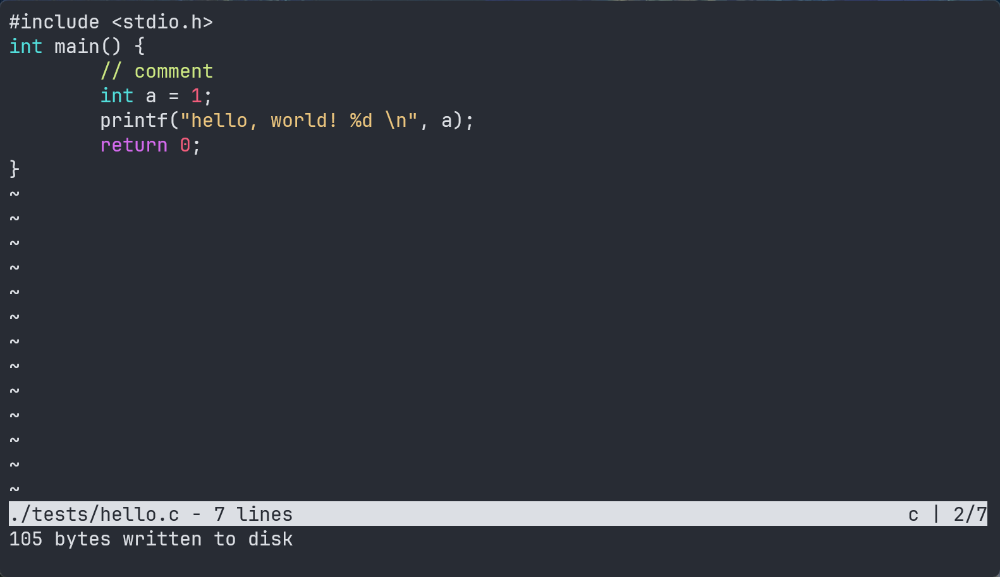

# texc

- `texc` is a pure C text editor (Single .c file with Chinese comments) , support:
    - Open & browser a text file;
    - Edit text file;
    - Basic highlight syntax for C/CPP.

- Show: 
    

- Texc's [Docs Page](./html/index.html)

- It's refer to [kilo](https://viewsourcecode.org/snaptoken/kilo) and easy to extern function such as: content diff or other languages' highlight syntax ...
